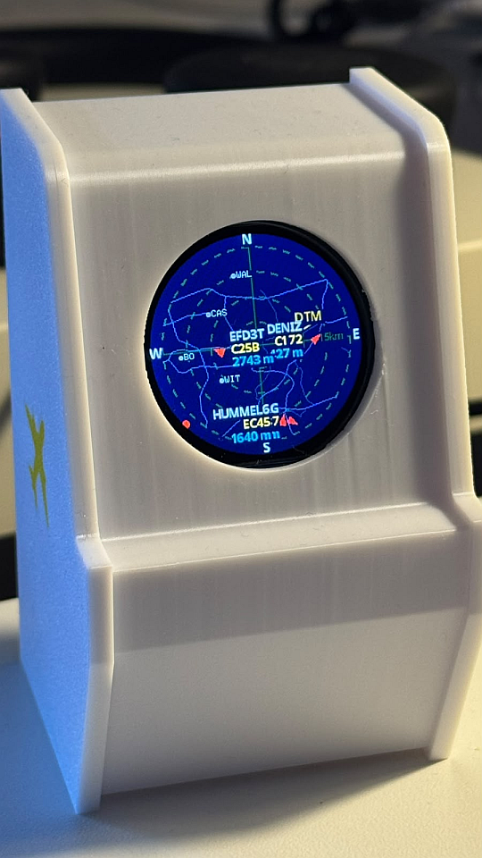

# Plane Radar



Firmware for an **ESP32-C3 Super Mini** with a **1.28-inch round GC9A01 display** at 240 x 240 pixels. The device renders a live ADS-B radar around a configurable location and provides airport/runway data, routes, aircraft labels, weather, time, browser configuration, OTA updates, and a browser-based simulator.

**3D-printed case:** [MakerWorld](https://makerworld.com/de/models/3039652-esp32-plane-radar#profileId-3417884)
**Firmware releases:** [GitHub Releases](../../releases)

## Features

- Live nearby aircraft from [adsb.fi](https://opendata.adsb.fi/)
- Circular radar display with configurable 5, 10, 15, and 25 km range presets
- Aircraft heading triangles, speed vectors, altitude, callsign, route, and compact aircraft type labels
- Direction markers for aircraft outside the display range but inside the ADS-B query radius
- Airport and runway overlay using embedded OurAirports data
- ICAO or IATA airport labels and airport selection by ICAO/IATA code
- Motorway, primary-road, city, water, grid, and aircraft map layers
- Local weather, humidity, time, date, temperature units, altitude units, and text scaling
- Configurable colors and layer visibility through the separate `Component Setup` page
- Authenticated OTA firmware updates
- Captive portal and LAN configuration through WiFiManager
- Runtime diagnostics, heap monitoring, temporary enrichment backoff, and task watchdog protection
- Browser-based simulator using the same airport, runway, and map data as the firmware

## Hardware

| Part | Specification |
|------|---------------|
| Controller | ESP32-C3 Super Mini |
| Display | 1.28-inch round GC9A01, 240 x 240 |
| Framework | Arduino via PlatformIO |
| Serial monitor | 115200 baud |

### Wiring

| GC9A01 | ESP32-C3 |
|--------|----------|
| VCC | 3V3 |
| GND | GND |
| RST | GPIO 0 |
| CS | GPIO 1 |
| DC | GPIO 10 |
| SDA / MOSI | GPIO 3 |
| SCL / SCLK | GPIO 4 |
| BOOT button | GPIO 9, active LOW |

The display SPI configuration is defined in `include/config.h`. The current hardware configuration uses 40 MHz SPI, display inversion, and RGB order configured for the GC9A01 module used by this project.

## First Start

If no valid Wi-Fi credentials are stored, the device opens the setup access point:

```text
SSID: PlaneRadar-Setup
URL: http://192.168.4.1
```

The setup screen also advertises the mDNS address:

```text
http://plane-radar.local
```

1. Connect a phone or computer to `PlaneRadar-Setup`.
2. Open `http://192.168.4.1` or `http://plane-radar.local`.
3. Enter the home Wi-Fi credentials.
4. Save the settings.
5. Reconnect the client to the home network.

After connecting to Wi-Fi, the device is available at:

```text
http://plane-radar.local
http://<device-ip>
```

Some clients resolve `.local` addresses slowly. The IP address shown in the serial monitor or router is the fallback.

## Portal Pages

The LAN portal and the setup access point expose the same configuration interface.

### Main Page

The main page provides links for:

- Wi-Fi configuration
- Common setup
- Device information
- Firmware update
- Restart
- Exit
- Display preview

The `Display` page shows a browser preview of the current round display and refreshes the BMP image periodically.

### Common Setup

`Common Setup` contains general device settings:

- Radar latitude and longitude
- Airport selection by ICAO or IATA code
- Reset location to the configured default
- Kilometer or mile distance labels
- IATA or ICAO airport labels
- Runway overlay enable/disable
- Radar range
- Footer and weather visibility
- Fahrenheit/Celsius
- Feet/metres
- 12-hour/24-hour clock
- Radar text scale from 80% to 130%
- Night-mode enable/disable and start/end time
- OTA password

Common settings are stored persistently in NVS.

### Component Setup

`Component Setup` is intentionally separate from WiFiManager so the common page stays small and reliable.

For each drawable radar component it provides:

- Color selection
- `Back to default`
- Visibility `On` checkbox where the component is independently hideable

Configured components include:

- Background
- Grid
- Center marker
- Labels
- Aircraft
- Track vector
- Aircraft type labels
- Altitude labels
- Runways
- Runway labels
- Motorways
- Primary roads
- Cities
- Footer background

The footer's overall visibility remains available in Common Setup. Background and footer background are color-only because they are not independently hideable components in the display model.

## BOOT Button

The BOOT button is connected to GPIO 9 and is active LOW.

| Action | Effect |
|--------|--------|
| Short tap | Cycle the range preset: 5 -> 10 -> 15 -> 25 km |
| Hold for 3 seconds | Clear Wi-Fi, location, units, display settings, and OTA password, then restart into setup |
| Hold during power-on | Force the setup portal for credential recovery |

## Radar Display

### Range Presets

| Ring 3 label | Approximate outer aircraft scale |
|--------------|----------------------------------|
| 5 km / 3 mi | 6.7 km |
| 10 km / 6 mi | 13.3 km |
| 15 km / 9 mi | 20 km |
| 25 km / 16 mi | 33.3 km |

The selected range and distance unit survive reboot.

### Aircraft

- Aircraft inside the outer ring are rendered as red heading triangles.
- A magenta speed vector shows the projected movement direction.
- Aircraft outside the ring but inside the ADS-B query radius are shown as bearing markers on the display rim.
- Callsigns are shown while route enrichment is unavailable.
- Routes are displayed as origin-destination pairs such as `FRA-DUS` when available.
- Aircraft types are compacted for the display, for example `Boeing 737-800` becomes `B737-800`.
- Ground aircraft are hidden by default.

Origin and destination are not part of the basic ADS-B position response. Active callsigns are optionally enriched through [ADSBDB](https://www.adsbdb.com/). Successful results are cached for six hours and misses for ten minutes. Enrichment is rate-limited and uses an increasing retry backoff after TLS or network failures so it cannot block the main radar function continuously.

### Airports and Runways

Airport and runway data is generated from [OurAirports](https://ourairports.com/data/).

- Only `large_airport` entries are embedded.
- Open runway strips are included.
- Helipads are excluded.
- Runways are drawn in teal when enabled.
- Airport labels can use ICAO or IATA codes.
- The browser setup can select airports by either code.

Regenerate the embedded data with:

```bash
python scripts/build_large_airports.py
```

The generated files are:

```text
include/data/large_airports.h
src/data/large_airports_data.cpp
```

### Roads and Map Layers

Road and water geometry is embedded in the firmware for the supported display area. Map data is rendered with circular clipping to the active radar range.

Map data is based on [OpenStreetMap](https://www.openstreetmap.org/) contributors and is distributed under the ODbL where applicable.

### Weather and Time

Current conditions and timezone data come from [Open-Meteo](https://open-meteo.com/). Weather refreshes periodically using the configured radar location. NTP is used for the clock.

The weather row and complete footer can be disabled independently in Common Setup.

## Runtime Stability

The firmware uses several safeguards for the limited ESP32-C3 heap:

- ADS-B and weather responses are parsed directly from HTTP streams instead of retaining complete response strings.
- ADS-B JSON is filtered to the fields required by the display.
- Optional ADSBDB flight enrichment is rate-limited and cached.
- Repeated ADS-B TLS failures use an increasing backoff up to several minutes.
- Optional flight enrichment can be paused when the current heap or largest free block becomes low. It resumes automatically after a stable recovery period.
- A 15-second task watchdog detects a genuine main-loop stall after the initial Wi-Fi/setup phase.
- A controlled restart is only considered when the current free heap or largest free block remains critically low for several seconds.

The historical `min_heap` value is diagnostic only. It does not trigger a reset by itself.

Typical serial diagnostics look like:

```text
diag: uptime=120s heap=73000 min_heap=16000 largest=38000 wifi=3 rssi=-25 radar=1
adsb: request-ok t=900ms heap=70000 min_heap=16000
adsb: 8 aircraft
```

## Browser Simulator

The simulator is a framework-free browser implementation of the 240 x 240 radar display. It uses the repository's airport, runway, road, and water data where available and can use a local proxy for live ADS-B data.

From the repository root:

```powershell
python tools/radar_simulator/server.py
```

Open:

```text
http://localhost:8080/tools/radar_simulator/
```

The simulator includes:

- Radar range projection
- Circular clipping
- Aircraft symbols and vectors
- Routes and aircraft type enrichment
- Airport and runway overlays
- Location selection
- Unit, footer, weather, altitude, clock, and text-scale controls
- Layer visibility and color controls
- Night mode preview
- Mock-data fallback when live data is unavailable

### Windows Executable

Build the standalone simulator executable with:

```powershell
powershell -ExecutionPolicy Bypass -File tools/radar_simulator/build_windows.ps1
```

Output:

```text
dist/PlaneRadarSimulator.exe
```

Keep the console window open while using the executable because it hosts the local proxy/server.

## Configuration

Hardware and behavior defaults are defined in `include/config.h`.

| Area | Important values |
|------|------------------|
| Portal | AP name, portal IP, hostname, mDNS |
| Wi-Fi | Connect/reconnect timing and portal timeout |
| BOOT | GPIO pin, tap duration, reset hold duration |
| Display | SPI pins, inversion, RGB order, SPI frequency |
| Location | Default latitude and longitude |
| ADS-B | Fetch interval and ground-aircraft visibility |
| Flight enrichment | Lookup interval, timeout, cache durations, failure backoff |
| Weather | Endpoint, timeout, and refresh interval |
| Runtime protection | Heap thresholds and task-watchdog timeout |
| OTA | Initial username/password defaults |

Machine-specific Wi-Fi defaults can be placed in the ignored `include/config_local.h`. Use `include/config_local.example.h` as a starting point.

## Project Layout

```text
include/
  config.h
  data/large_airports.h
  hardware/
  services/
  ui/
data/
  ui_font.vlw
partitions/
  plane_radar.csv
scripts/
  build_large_airports.py
  merge-firmware.sh
  merge_firmware.py
src/
  main.cpp
  data/
  hardware/
  services/
  ui/
tools/
  radar_simulator/
  GetRoadsAndWaterForPlaneRadar/
```

## Build and Upload

The PlatformIO environment is `supermini`.

```bash
pio run -e supermini
pio run -t upload -e supermini
pio device monitor -b 115200
```

The project uses:

- PlatformIO
- Espressif32 platform 6.5.0
- Arduino framework
- C++17
- LovyanGFX
- WiFiManager
- ArduinoJson 7

## Web-Flashable Images

Build the merged full-flash image:

```bash
chmod +x scripts/merge-firmware.sh
./scripts/merge-firmware.sh
```

The merged image is written to:

```text
release/plane-radar-merged.bin
```

For an already-built firmware:

```bash
./scripts/merge-firmware.sh --no-build
```

The merged/full image contains the bootloader and partition table and is flashed at offset `0x0`. It must not be uploaded through the OTA page.

## OTA Updates

1. Open `http://plane-radar.local` or the device IP.
2. Choose **Firmware update**.
3. Log in as `admin` with the configured OTA password.
4. Upload the application image ending in `-ota.bin`.
5. Keep the device powered until it restarts.

The initial OTA password is:

```text
plane-radar
```

Change it before exposing the device to a shared network.

If migrating from the old single-application partition layout, flash the new full/merged image over USB once. Later updates can use the OTA image.

## CI and Releases

GitHub Actions provides:

| Workflow | Trigger | Output |
|----------|---------|--------|
| Build | Push or pull request to `main` | Firmware artifacts for `supermini` |
| Release | Git tag matching `v*` | Full image, OTA image, and checksums |

Create a release with:

```bash
git tag v1.0.0
git push origin v1.0.0
```

Use the full image for first installation or recovery. Use the OTA image in the authenticated firmware page.

## Runtime Services and Dependencies

External runtime services:

- [adsb.fi](https://opendata.adsb.fi/) - nearby aircraft
- [ADSBDB](https://www.adsbdb.com/) - optional route and aircraft-type enrichment
- [Open-Meteo](https://open-meteo.com/) - weather and timezone data
- [OurAirports](https://ourairports.com/data/) - generated airport/runway dataset
- [OpenStreetMap](https://www.openstreetmap.org/) - map data source

PlatformIO dependencies:

- [LovyanGFX](https://github.com/lovyan03/LovyanGFX)
- [WiFiManager](https://github.com/tzapu/WiFiManager)
- [ArduinoJson](https://github.com/bblanchon/ArduinoJson)

## Troubleshooting

### Setup page shows only Save and Connected

Use the current `Common Setup` and `Component Setup` pages. The color and layer settings are intentionally separate from the WiFiManager parameter page to reduce page-generation memory usage.

If `.local` does not resolve, open the device IP from the serial log.

### ADS-B requests fail with TLS or DNS errors

The radar keeps its last valid data while failed requests use a backoff. Check:

- Wi-Fi signal strength
- router DNS availability
- access to `opendata.adsb.fi`
- current heap and `largest` diagnostic values

Optional flight enrichment may pause temporarily while the main ADS-B radar continues running.

### Watchdog output appears during startup

The task watchdog is intentionally enabled only after the initial Wi-Fi/setup phase. A watchdog message after startup indicates that the main loop was blocked for longer than the configured timeout.

### First installation or recovery

Use the full/merged image at flash offset `0x0`. Do not upload it through the OTA form.

## Licensing, Attribution, and Origins

### Project License

The firmware source in this repository is distributed under the [MIT License](LICENSE). The license and the copyright notice in `LICENSE` must remain with copies or substantial portions of the software.

This repository is derived from the work of:

- [WatskeBart/ESP32-Plane-Radar](https://github.com/WatskeBart/ESP32-Plane-Radar)
- [MatixYo/ESP32-Plane-Radar](https://github.com/MatixYo/ESP32-Plane-Radar)

The original project concept and substantial parts of the original implementation are credited to the original authors. Changes and additions in this repository are maintained by the current project contributors. The complete upstream copyright and license information remains in [`LICENSE`](LICENSE).

### Third-Party Software

The firmware uses third-party libraries. Each library remains subject to its own license and copyright notices:

- [LovyanGFX](https://github.com/lovyan03/LovyanGFX)
- [WiFiManager](https://github.com/tzapu/WiFiManager)
- [ArduinoJson](https://github.com/bblanchon/ArduinoJson)

The versions used for a build are declared in `platformio.ini`. Refer to the respective upstream repositories for their current license texts and notices.

### Data Sources and Services

- Map geometry is derived from [OpenStreetMap](https://www.openstreetmap.org/). Where OSM data is included or displayed, attribution is required under the [ODbL](https://opendatacommons.org/licenses/odbl/) and should include: `© OpenStreetMap contributors`.
- Airport and runway data is generated from [OurAirports](https://ourairports.com/data/). The generated dataset is included in the firmware and should retain its source reference and any applicable current source terms.
- Live aircraft data is requested from [adsb.fi](https://opendata.adsb.fi/). Optional route and aircraft-type enrichment uses [ADSBDB](https://www.adsbdb.com/).
- Weather and timezone data are requested from [Open-Meteo](https://open-meteo.com/). Use of these services remains subject to their current terms, attribution requirements, rate limits, and availability.

### Project Assets

- The device photo in `docs/images/plane-radar-device.png` is a project asset. Before publishing or redistributing the repository, confirm that the repository has permission to redistribute this image and add a photographer/copyright credit here if required.
- The 3D-printable case is provided through [MakerWorld](https://makerworld.com/de/models/3039652-esp32-plane-radar#profileId-3417884). The case's license and redistribution terms are separate from the firmware license and must be checked on the MakerWorld project page.

This section describes the project's known origins and attribution requirements; it is not legal advice. When redistributing hardware, firmware, generated data, or project images, preserve the relevant license files, notices, and source attributions.

## Credits

Thanks to the original project authors, the maintainers of the third-party libraries, the providers of the runtime services, and the contributors to the open data used by this project.
